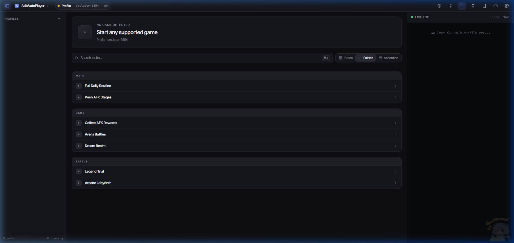
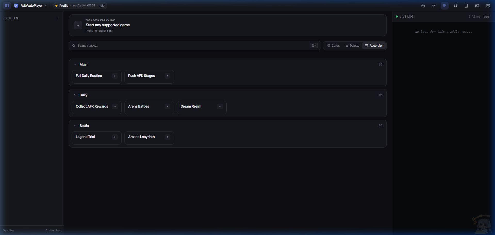

# AFK Journey
## Support Game Languages:
- **English**

## Supported Resolutions:
- **1080x1920**

## Bot Features
AdbAutoPlayer provides a comprehensive suite of automation for AFK Journey:

* **Daily Routine:** Automatically perform all daily tasks in one click.
* **Stage Pushing:** Push AFK stages with automatic team formation and retries.
* **Arena Battles:** Automate your daily arena matches.
* **Dream Realm:** Collect rewards and participate in Dream Realm battles.
* **Legend Trial:** Progress through the various towers.
* **Arcane Labyrinth:** Clear the labyrinth levels automatically.

## In-Game Recommended Settings  

To improve performance and reduce lag, adjust the following in-game settings:  

- Set Graphics to **Minimum** while keeping high-performance **Power Mode**.  
- **Disable Battle Texts**: Go to `Battle > Combat Text > Off`. This prevents excessive on-screen text, reducing emulator lag.  
- **Disable Battle Logs**: Under Combat Text, turning off battle logs minimizes post-battle processing and improves overall game performance.  
