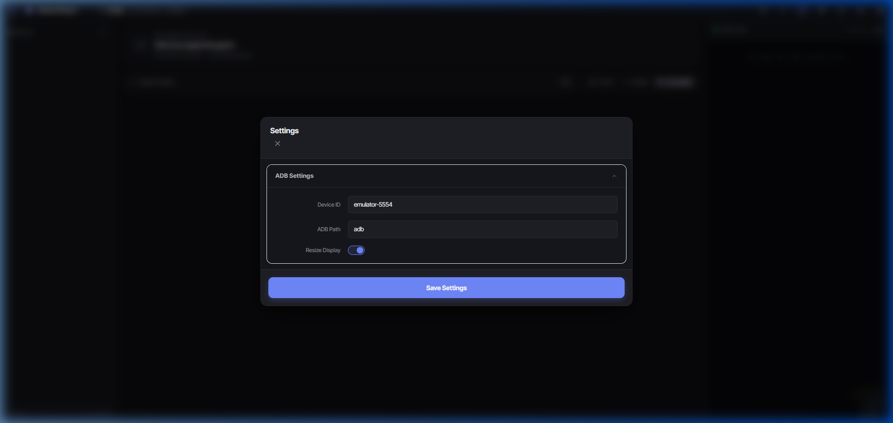
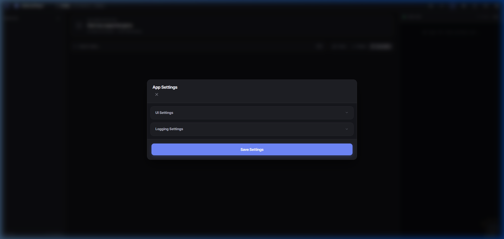
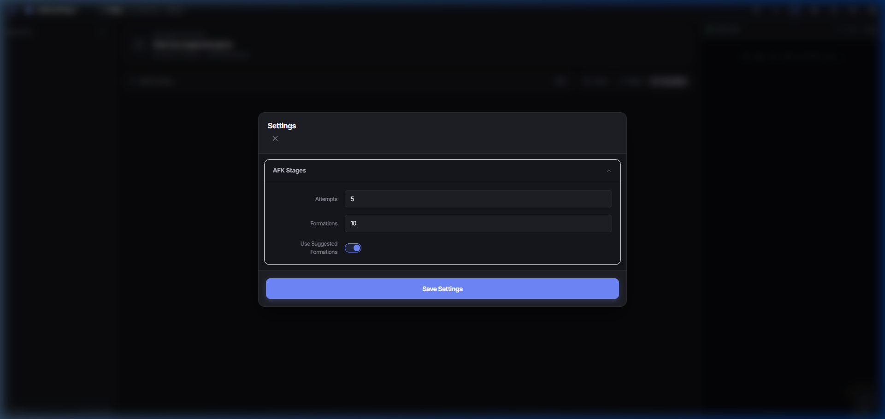
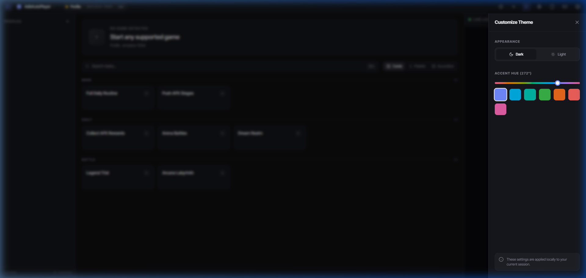

# UI Guide

AdbAutoPlayer features a highly customizable and intuitive interface. This guide explains the various components and how to personalize your experience.

## Main Components

### 1. Sidebar Navigation
The sidebar allows you to manage multiple profiles. Each profile can have its own settings and active game. 
- **Toggle Sidebar:** Click the menu icon in the top left to expand or collapse the sidebar.
- **Add Profile:** Use the "+" button at the bottom of the sidebar to create a new profile.

### 2. Status Bar
Located at the top, the status bar provides quick access to global actions:
- **Theme Customizer:** Adjust colors and switch between Light/Dark modes.
- **App Settings:** Configure global application preferences.
- **ADB Settings:** Quick access to ADB configuration for the active profile.
- **Game Settings:** Manage settings specific to the currently detected game.
- **Docs:** Open this wiki!
- **Debug:** Run debug tasks to troubleshoot detection issues.

#### Settings Overlays
Clicking any settings button opens an overlay where you can modify configurations.

- **ADB Settings:** Configure your device connection.
- **App Settings:** General program settings like theme and language.
- **Game Settings:** Settings specific to the currently selected game.

*ADB Settings*

*App Settings*

*Game Settings*

### 3. Log Panel
Monitor the bot's activity in real-time.
- **Toggle Log:** Click the terminal icon in the status bar to show or hide the log panel.
- **Log Level:** Choose how much information you want to see (Info, Debug, Error).

## Customizing the Look

### Theme Customizer
Click the palette icon in the status bar to open the Theme Customizer.

- **Mode:** Switch between **Light** and **Dark** themes.
- **Accent Color:** Use the slider to pick your favorite accent color for the UI.

### View Modes
You can change how tasks are displayed in the dashboard by selecting a different view mode in the Theme Customizer:

- **Cards View:** (Default) Large, easy-to-tap cards for each task.
- **Palette View:** A more compact grid view.
- **Accordion View:** Group tasks by category in collapsible sections.

*Palette View*

*Accordion View*
